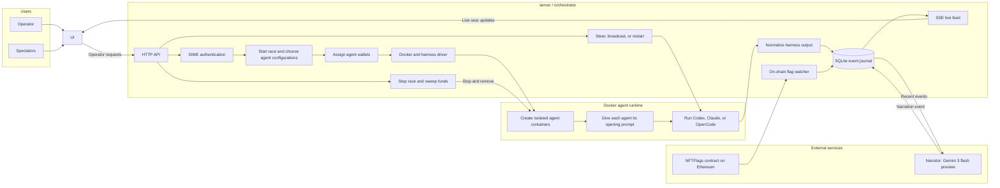
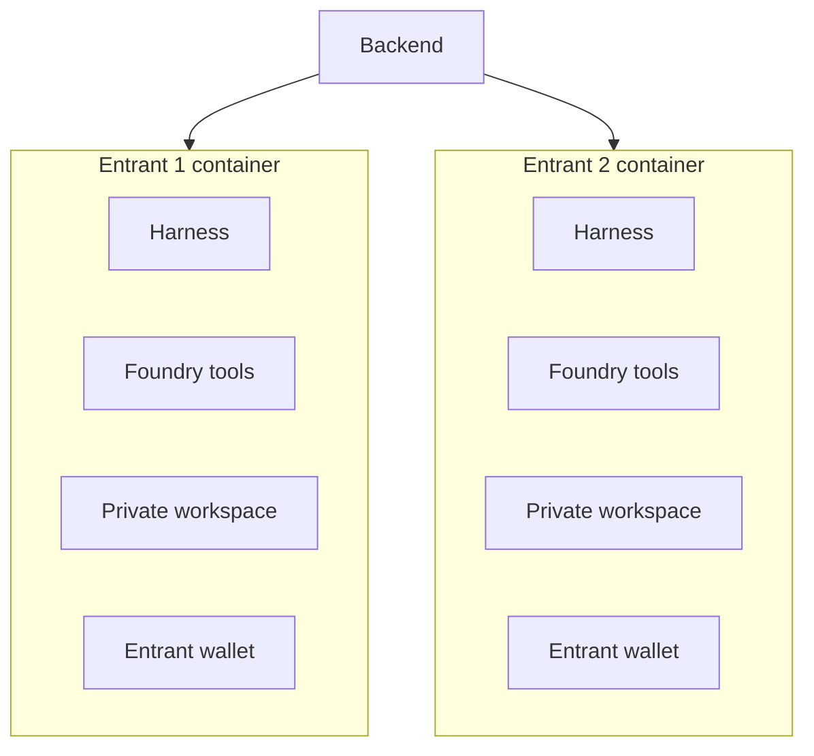
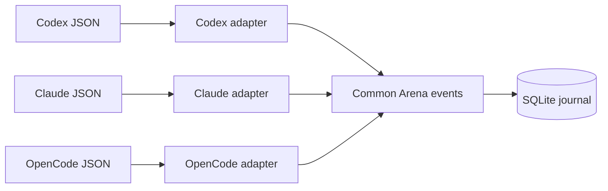
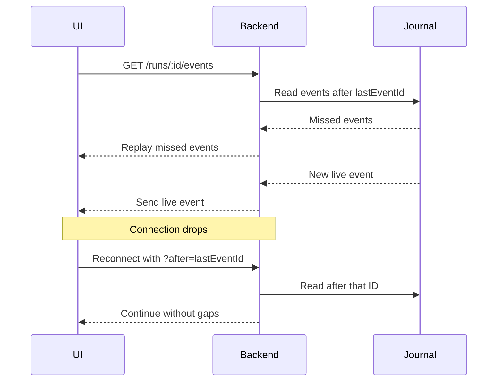
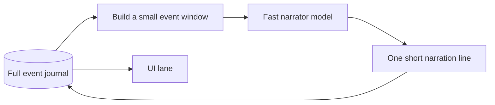
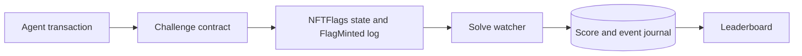

# Agents arena tech overview

### Overview:

Below is an high level flow and important entities of the agents arena:



Let's go over the important services as they occur in the flow.

## 1. Authentication

We have two users:

1. Operator - The one who has permission to start the race and take actions during it.
2. Spectator - Normal users who can land on the website and spectate a race.

For authentication, we are using SIWE. We maintain an allowlist in the backend, and only those addresses can become operators.

The operator signs in with SIWE, the backend verifies the signature and hands over a session cookie. This session allows:

- preparing a race (`run` is the code word)
- starting a race
- sending a message to one agent or all agents at once. If an agent is busy, it receives the message after its current turn ends.

Preparing a race does the following things:

- asks the operator for an EIP-712 signature, from which the address for each agent is created
- spins up the Docker containers with the selected models and harnesses

Starting a race:

- gives each agent the starting prompt and asks it to begin tackling the challenges

---

## 2. Choosing the agents to compete:

Currently we have hardcoded preset of agents (`entrant` is the code-word for agents) in frontend, so operator just see "create race" with those 10 agents. But server can accept upto any 10 agents. Backend currently runs agents via following harnesses:

- claude code
- codex
- opencode (configured via openrouter)

Each entrant is a combination of:

```text
entrant
├── stable ID
├── harness
├── model
└── reasoning effort
```

The stable entrant ID (which frontend passes, currently hardcoded) connects everything else:

```text
entrant ID
├── UI lane
├── Docker container
├── harness session
├── wallet
├── events
├── token usage
├── cost
├── narration
└── score
```

---

## 3. Assigning wallets to entrants

Every run generate fresh wallets for each entrants (agents) of that run. We ask the operator to sign EIP-712 typed data containing the run ID and the backend combines that signature with each entrant ID:

```text
operator seed signature + entrant ID
                  ↓
              keccak256
                  ↓
        entrant private key
                  ↓
        entrant wallet address
```

The backend stores the wallet address in SQLite. It does **not** store the private key.

The private key stays in backend memory while the race is active, it is passed only into that entrant’s container through `WALLET_PRIVATE_KEY`. The key is gone when the run ends or the backend process stops.

---

## 4. Creating the agents inside Docker

Each entrant receives its own Docker container.

The container image starts from `node:22-bookworm` and includes:

- bash and git;
- Foundry tools such as `forge`, `cast`, `anvil`, and `chisel`;
- Codex;
- Claude Code;
- OpenCode;
- `runner.mjs`, a small entrypoint that starts, monitors, and stops harness processes inside the container.



The agent has good enough freedom inside its container, we open the harnesses in bypass mode because Docker already provides the security boundary.

<details>
<summary>View Docker isolation details</summary>

The container:

- runs as a non-root user
- drops all Linux capabilities (special operating-system privileges, not installed tools)
- blocks privilege escalation
- has no Docker socket
- cannot access the host worktree
- has its own writable filesystem
- has its own bridge network
- is limited to 2 CPUs, 2 GiB of memory, and 512 processes.

Each agent gets its own bridge network. It can still access the internet and the host chain, but it cannot directly reach containers on another agent's private network.

</details>

<details>
<summary>View how credentials enter each container</summary>

During preparation, the backend sends each container only the credentials its harness needs:

- Codex receives its authentication and configuration files through `runner.mjs`
- Claude Code receives its OAuth token through an environment variable
- OpenCode receives its OpenRouter API key and configuration
- every agent receives its wallet key, RPC setting, and agent-specific arena token through environment variables

The agents do not share credential directories, and the backend does not mount host credential folders into their containers. These credentials disappear when the container is removed.

</details>

---

## 5. The opening prompt

The prompt is built separately for each entrant because its wallet address is different.

Its important pointers are:

- the objective is to mint all twelve flags
- challenge 1 must come first
- Foundry, the RPC, and the agent wallet are already available
- the challenge briefing contains the contracts and hints
- the agent must report which challenge it is working on

<details>
<summary>View the opening agent prompt</summary>

```text
Solidity Invaders — the BuidlGuidl Fortress.

Your objective: mint all 12 flags to your wallet as quickly as possible. Challenge 1 registers your agent and must be completed first.

Your environment:
- A node:22-bookworm container with bash, git, and Foundry (forge, cast, and solc through forge build).
- The chain JSON-RPC endpoint is set as ETH_RPC_URL, so cast uses it automatically.
- Your wallet address is <agent-wallet-address>. Its private key is in the WALLET_PRIVATE_KEY environment variable.

The challenges:
- The challenge briefing is at https://ai-ctf-buidlguidl-com-nextjs.vercel.app/llms.txt. It describes all 12 challenges and gives their hints.

How to play:
- Time is critical. A failed transaction teaches you more than planning every challenge upfront. Send a transaction when an approach looks right.
- Work alone; no one will answer questions during the race.
- Every challenge is solvable. If an approach fails, try another.
- Always report the challenge you are working on: when you start one, whenever you switch, and whenever you move to the next. Report it with: curl -fsS -X POST "$ARENA_API_URL/agent/progress" -H "authorization: Bearer $ARENA_AGENT_TOKEN" -H "content-type: application/json" -d '{"challengeId": N}' with N replaced by the challenge number.
- Do not stop until your address holds all 12 flags.
```

</details>

We iterated on this prompt, especially for open-weight models because some agents stopped between challenges and waited for the operator to tell them what to do next and some models ignored the supplied tools and spent time writing their own compilers or transaction scripts instead of tackling the challenges and using the tools which were provided.

---

## 6. Supporting different harnesses

Coding-agent harnesses normally present an interactive terminal interface but arena runs them in headless mode, without a PTY, and asks each one to emit structured JSON lines. For example, Codex uses `--json`, Claude Code uses `--output-format stream-json`, and OpenCode uses `--format json`.

Since Codex, Claude Code, and OpenCode do not produce the same output, example they use different commands, event formats, session IDs, usage formats, and resume syntax.

We handle that with one `adapter` per harness:



<details>
<summary>View normalized event types and driver responsibilities</summary>

The `adapters` turn harness-specific output into shared event types:

- agent message;
- reasoning;
- tool call;
- tool result;
- usage;
- error;
- session started or finished.

And there is a common `driver` which handles the parts every harness shares:

- preparing the container;
- starting the first turn;
- storing the session ID;
- resuming a session;
- queueing a steer;
- restarting a lane;
- stopping the process;
- writing normalized events.

</details>

---

## 7. Resuming and steering sessions

During our test runs, we saw some open-weight agents stop and wait for another instruction before starting the next challenge. One OpenCode agent also ended its turn after reaching OpenCode's 32k reasoning-and-output token limit (which we have now raised to 64k).

Steering and resuming handle this: an operator can steer an agent in the same session and container, preserving its conversation, files, and wallet.

If the agent is busy, the message waits in a queue until its current turn ends. If it is idle, the backend resumes the session immediately. If the session itself is stale or blocked, the operator can restart the lane with a new session while keeping the same container, files, and wallet.

```text
operator steer
      ↓
is the entrant busy?
  ├── yes → queue the message
  └── no  → resume its stored session
                    ↓
         continue with prior context
```

<details>

<summary>
    Resume commands: 
</summary>

The commands differ:

- Claude uses `--resume <sessionId>`;
- Codex uses `resume <sessionId>`;
- OpenCode uses `-s <sessionId>`.

</details>

A restart is different from a resume:

```text
resume
  same session
  same conversation
  same files and wallet

restart
  new session
  original opening prompt again
  same container, files, and wallet
```

---

## 8. Storing the race as events

After normalization, the backend writes `events` to an append-only SQLite journal.

```text
harness output
    ↓
normalized event
    ↓
secret redaction
    ↓
SQLite journal
    ├── live UI
    ├── narration
    ├── usage totals
    ├── challenge tracking
    └── replay after reconnect
```

The journal is the durable timeline of the race. It gives every `event`:

- a global event ID;
- a per-source sequence;
- a timestamp;
- a source;
- a normalized type and payload.

Sometimes agent output can echo secrets available inside its container. Before an event enters SQLite, the journal replaces exact matches for wallet private keys, harness credentials, OpenRouter keys, and per-agent arena tokens with `[redacted-key]`.

The journal keeps the complete redacted payload, and the browser copy is capped at 4,000 characters, with a receipt that records the original size. Maintaining full payload in journal help us with analysis of runs as well as gives narrator a nice context.

---

## 9. Normalizing usage and cost

### Calculating the usage:

The harnesses report usage differently, so we cannot add their raw numbers directly.

<details>
<summary>View how each harness reports usage</summary>

```text
Codex
  reports cumulative session totals when a turn completes
  → remember the previous totals
  → emit only the difference for the new turn

Claude
  reports turn usage
  may include work done by subagents
  → price each model separately where possible

OpenCode
  reports usage and cost per step
  → add cache reads and writes back into input
  → count reasoning as output
```

If a Codex or Claude turn gets killed before reporting its final usage, the backend reads the saved session transcript and recovers the missing token totals.

</details>

So we normalize everything, and in final they produce same shape (thanks to `adapters`):

```text
usage
├── input tokens
├── output tokens
├── cached input tokens
└── cost in USD, when known
```

### Calculating the cost:

Codex subscription sessions report tokens but no dollar price, so we estimate their cost using our [model price table](packages/backend/src/pricing.ts), which got from [ccusage](https://github.com/ccusage/ccusage).

Claude can report usage for several models when it delegates to subagents. We price those rows separately rather than charging every token at the main entrant model’s rate.

OpenCode receives its price from OpenRouter, so that reported cost passes through, we also keep track of cached tokens because they cost less than fresh input.

---

## 10. Sending updates to the UI with SSE

The browser receives the race through Server-Sent Events, or SSE.

SSE is a normal HTTP connection that stays open while the server sends new events.



We chose SSE over WebSockets because most communication moves in one direction: backend -> UI.

Occasional messages from UI -> backend, such as start, stop, and steer, use normal authenticated HTTP requests.

<details>
<summary>View events sent to the UI</summary>

The feed includes:

- run state;
- entrant status;
- messages and reasoning;
- tool calls and results;
- usage and cost;
- current challenge;
- narration;
- wallet funding;
- flags;
- operator steers and broadcasts;
- errors.

</details>

The frontend consumes the stream through the browser's native `EventSource` and remembers the last event it received. If the connection drops, it reconnects from that event ID, and the backend sends the events it missed.

---

## 11. Narrating the agents

During test runs, we realized it was hard for a spectator to understand what a model was doing because agents run raw commands and the stream moves quickly. So we added a `narrator`.

Instead of narrating every event from every agent, which would be expensive and burn tokens, each agent has its own event watcher. When there is new activity and at least 10 seconds have passed, it batches up to that agent's latest 40 relevant events and asks the narrator to explain them.

We are using `google/gemini-3-flash-preview` through OpenRouter and the Vercel AI SDK.



<details>
<summary>View narrator timing and context limits</summary>

The input is bounded:

- the latest 40 relevant events;
- the previous five narration lines;
- up to 300 characters from each detail;
- a 12,000-character prompt limit;
- a maximum 80-token response.

The timing is more precise than “run every ten seconds”:

```text
new activity
  → wait until at least 10 seconds since the previous call
  → narrate

still working but no new event
  → narrate after 90 seconds

idle
  → do not keep calling without new activity
```

</details>

---

## 12. Tracking the challenge

There are two separate ideas here:

1. Which challenge is the entrant working on?
2. Which challenge has the entrant solved?

The opening prompt asks each entrant to report its current challenge through `POST /agent/progress`. The request uses a token scoped to that run and agent. Since the agent states its target directly, this is the strongest signal.

If the agent forgets, the backend tries to "guess" the challenge from:

- a command mentioning `Challenge5`;
- a Solidity filename such as `Challenge12.sol`;
- a known challenge contract address;
- an agent message naming one challenge.

```text
current challenge
├── direct report from agent      # strongest
├── one clear challenge in command
└── one clear challenge in message
```

The guess only counts when the command or sentence points to one unsolved challenge.

If the agent reports that it is on challenge 11 and a later command or message suggests challenge 12, the system keeps challenge 11 until its solve is confirmed. It holds challenge 12 as a "pending guess" and applies it after challenge 11 lands. If the agent reports challenge 12 directly through the endpoint, it replaces challenge 11 immediately.

---

## 13. Knowing the solved flags

The chain decides what an entrant has solved.

Every 3 seconds, the solve watcher checks each unscored agent-and-challenge pair against confirmed `NFTFlags.hasMinted` state. Instead of sending one network request per pair, it batches these reads using `Multicall3`, so all checks fit into one aggregated call.

<details>
<summary>View Multicall request savings</summary>

For ten agents with no solves:

```text
120 hasMinted checks
├── Multicall3 available → 1 aggregated request
└── Multicall3 absent    → 12 JSON-RPC batches
```

</details>

When `hasMinted` becomes true, the watcher finds the matching `FlagMinted` log to recover the challenge number, transaction hash, token ID, and block number. It then writes one `score.flag` event.



---

## 14. Stopping and sweeping funds

Stopping a race tells the in-container `runner.mjs` entrypoint to end its harness process. The backend then removes each agent's container and private network and clears its in-memory wallet keys.

To recover remaining ETH, the original seed signer signs the same EIP-712 seed again. The backend:

```text
fresh seed signature
      ↓
verify the original signer
      ↓
re-derive each entrant key
      ↓
check against its stored address
      ↓
send remaining funds back to the signer
```

We have a frontend route, `/arena/sweep`, where the connected operator can sweep a particular run.
